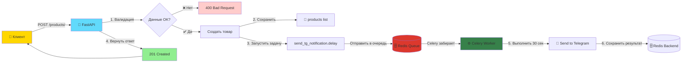
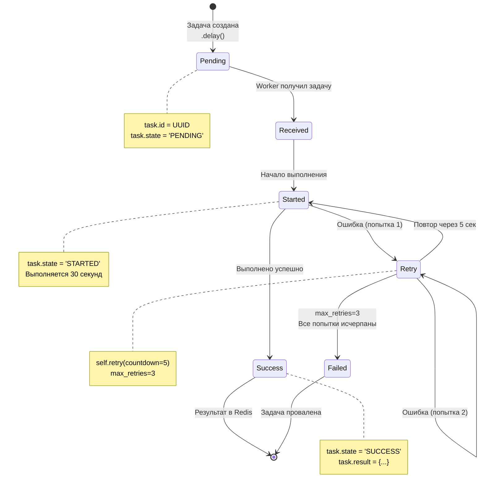
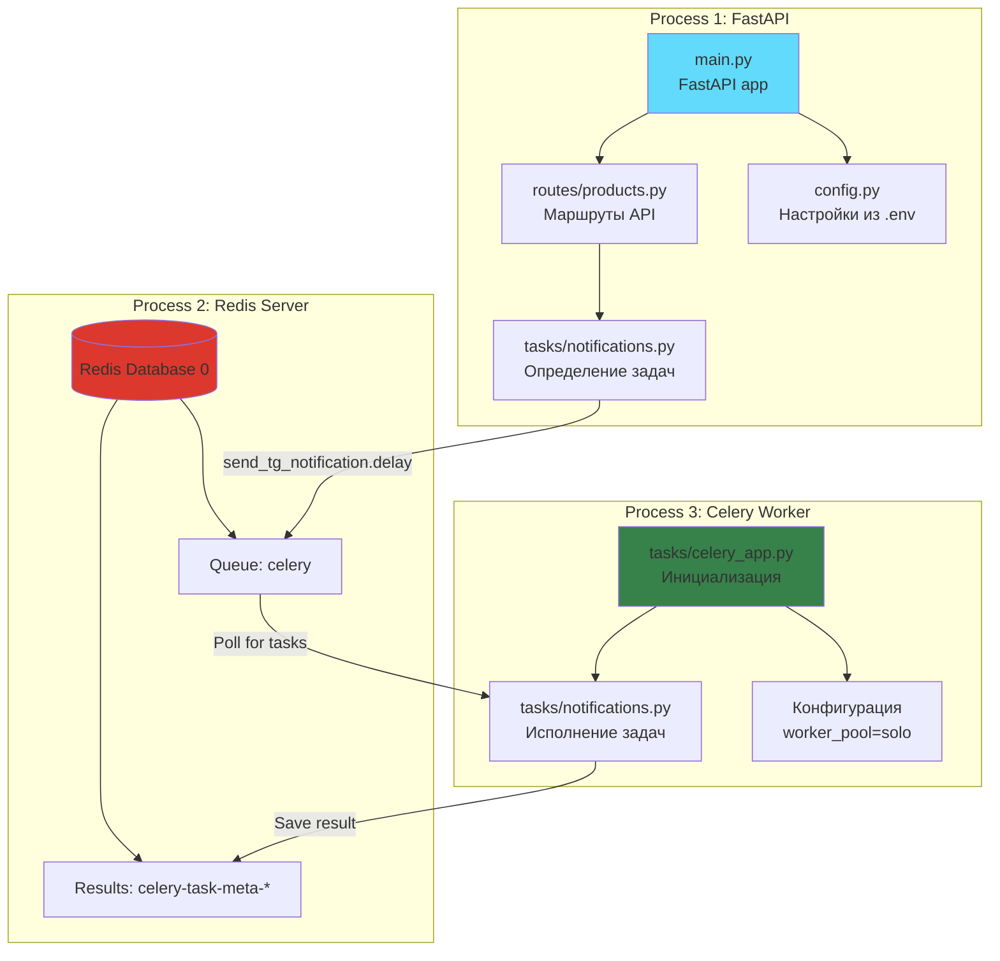
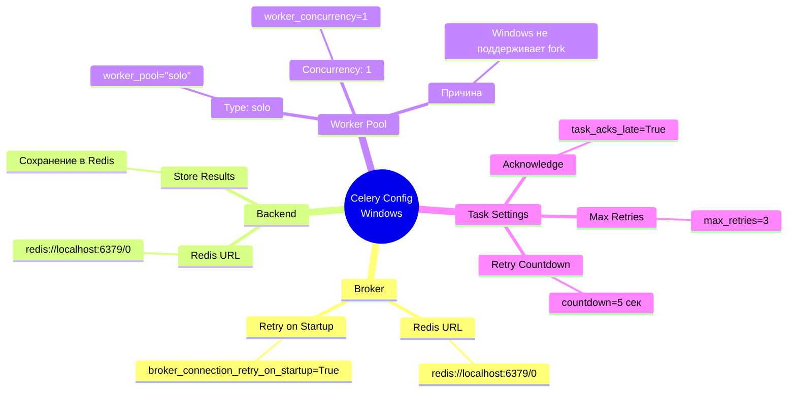
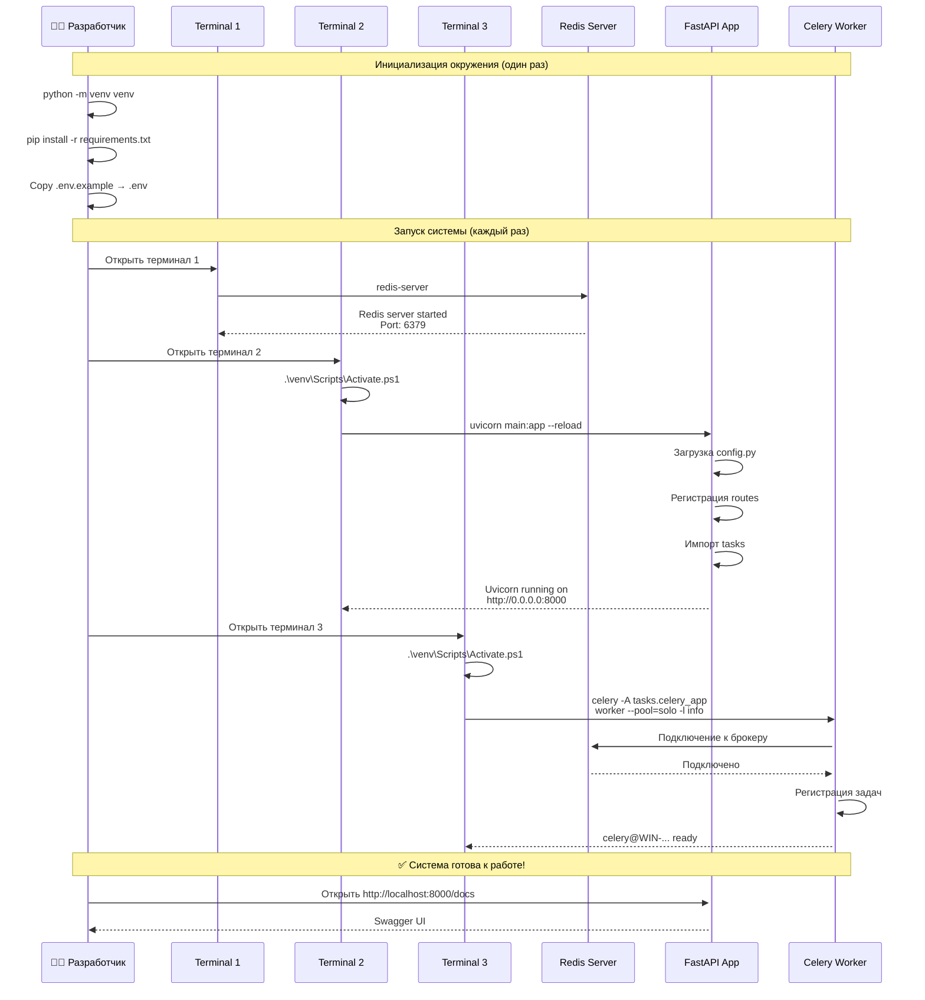
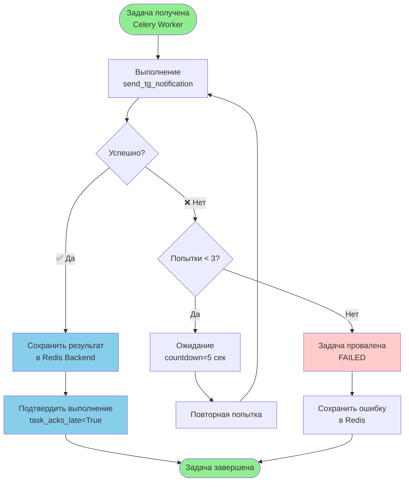
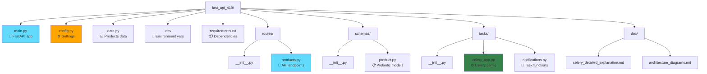
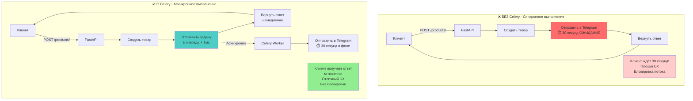

# 📊 Диаграммы архитектуры FastAPI + Celery + Redis

## 1. Общая архитектура системы

```mermaid
graph TB
    subgraph "Клиентская часть"
        Client[👤 Клиент<br/>Браузер/Postman]
    end
    
    subgraph "Backend - FastAPI Application"
        FastAPI[🚀 FastAPI Server<br/>uvicorn main:app<br/>Port: 8000]
        Routes[📍 Routes<br/>products.py]
        Tasks[📦 Tasks Module<br/>notifications.py]
        Config[⚙️ Config<br/>settings from .env]
    end
    
    subgraph "Message Broker & Backend"
        Redis[(🗄️ Redis Server<br/>Port: 6379<br/>Database: 0)]
        Queue[📬 Task Queue<br/>Задачи в очереди]
        Results[📋 Results Backend<br/>Результаты выполнения]
    end
    
    subgraph "Background Worker"
        Celery[⚙️ Celery Worker<br/>celery worker --pool=solo]
        Executor[🔧 Task Executor<br/>send_tg_notification]
    end
    
    Client -->|HTTP Request| FastAPI
    FastAPI --> Routes
    Routes --> Tasks
    Tasks -->|.delay()| Redis
    Redis --> Queue
    Queue -->|Poll| Celery
    Celery --> Executor
    Executor -->|Save Result| Results
    Results --> Redis
    FastAPI -->|Read Settings| Config
    Celery -->|Read Settings| Config
    
    style FastAPI fill:#61dafb,stroke:#333,stroke-width:2px
    style Redis fill:#dc382d,stroke:#333,stroke-width:2px
    style Celery fill:#37814a,stroke:#333,stroke-width:2px
    style Client fill:#ffd700,stroke:#333,stroke-width:2px
```

---

## 2. Поток создания товара с фоновой задачей



---

## 3. Жизненный цикл задачи Celery



---

## 4. Компоненты системы и их взаимодействие



---

## 5. Конфигурация Celery для Windows



---

## 6. Порядок запуска системы



---

## 7. Обработка ошибок и повторные попытки



---

## 8. Структура файлов проекта



---

## 9. Redis: Структура данных

```mermaid
graph TB
    subgraph Redis[(Redis Server<br/>localhost:6379)]
        DB0[Database 0]
        
        subgraph "Broker - Очередь задач"
            Queue[Queue: 'celery'<br/>Type: List]
            Task1[Task 1: JSON]
            Task2[Task 2: JSON]
            Task3[Task 3: JSON]
            
            Queue --> Task1
            Queue --> Task2
            Queue --> Task3
        end
        
        subgraph "Backend - Результаты"
            Meta1[celery-task-meta-uuid1<br/>Type: String<br/>TTL: 1 day]
            Meta2[celery-task-meta-uuid2<br/>Type: String<br/>TTL: 1 day]
            
            Result1[Status: SUCCESS<br/>Result: {...}]
            Result2[Status: PENDING<br/>Result: null]
            
            Meta1 --> Result1
            Meta2 --> Result2
        end
        
        DB0 --> Queue
        DB0 --> Meta1
        DB0 --> Meta2
    end
    
    FastAPI[FastAPI] -->|LPUSH| Queue
    Celery[Celery Worker] -->|BRPOP| Queue
    Celery -->|SET| Meta1
    
    style Redis fill:#dc382d,color:#fff
    style Queue fill:#ff6b6b
    style Meta1 fill:#4ecdc4
    style Meta2 fill:#4ecdc4
```

---

## 10. Сравнение: С Celery vs Без Celery



---

## 📝 Пояснения к диаграммам

### Диаграмма 1: Общая архитектура

Показывает все компоненты системы и их взаимосвязи. Три основных процесса работают независимо.

### Диаграмма 2: Поток создания товара

Демонстрирует путь HTTP-запроса от клиента через FastAPI к Redis и Celery Worker.

### Диаграмма 3: Жизненный цикл задачи

State-диаграмма показывает все возможные состояния задачи: от создания до успеха/провала.

### Диаграмма 4: Компоненты системы

Детальная структура трёх процессов и их файлов.

### Диаграмма 5: Конфигурация Celery

Mind map всех критичных параметров для Windows.

### Диаграмма 6: Порядок запуска

Sequence diagram показывает правильную последовательность запуска всех компонентов.

### Диаграмма 7: Обработка ошибок

Flowchart логики повторных попыток с max_retries=3.

### Диаграмма 8: Структура файлов

Дерево файлов проекта с указанием назначения каждого файла.

### Диаграмма 9: Redis структура

Внутреннее устройство Redis: очереди задач и хранилище результатов.

### Диаграмма 10: Сравнение

Наглядное сравнение синхронного и асинхронного выполнения задач.

---

## 🎯 Ключевые моменты из диаграмм

1. **Три независимых процесса**: Redis, FastAPI, Celery Worker
2. **Асинхронность**: FastAPI не ждёт выполнения задачи
3. **Надёжность**: task_acks_late=True + max_retries=3
4. **Windows совместимость**: worker_pool="solo" обязателен
5. **Последовательность запуска**: Redis → FastAPI → Celery

---

**Все диаграммы совместимы с Mermaid и отображаются в GitHub, GitLab, VS Code**
