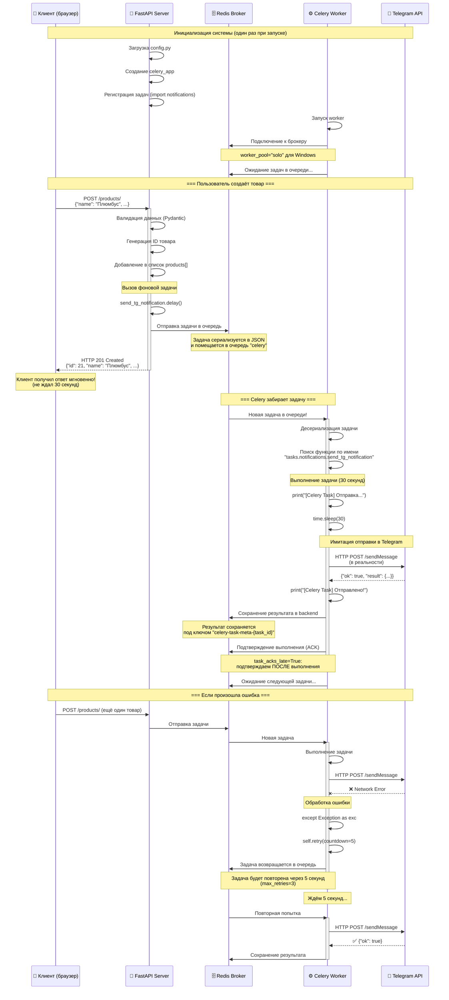

# 📚 Полный конспект: Celery + Redis + FastAPI на Windows

**Дата создания**: 15 октября 2025 г.  
**Проект**: Python419 - Учебное приложение FastAPI с фоновыми задачами  
**Автор документа**: Техническая документация для понимания архитектуры

---

## 🎯 Оглавление

1. [Общая архитектура системы](#общая-архитектура-системы)
2. [Подробный разбор параметров Celery](#подробный-разбор-параметров-celery)
3. [Разбор кода по файлам](#разбор-кода-по-файлам)
4. [Диаграмма последовательности работы](#диаграмма-последовательности-работы)
5. [Критические моменты для Windows](#критические-моменты-для-windows)
6. [Почему это работает сейчас](#почему-это-работает-сейчас)

---

## 🏗️ Общая архитектура системы

Наше приложение состоит из **трёх независимых процессов**, которые взаимодействуют через **Redis**:

```
┌─────────────────┐      ┌─────────────────┐      ┌─────────────────┐
│   FastAPI       │      │     Redis       │      │  Celery Worker  │
│   (Веб-сервер)  │◄────►│   (Брокер)      │◄────►│  (Обработчик)   │
└─────────────────┘      └─────────────────┘      └─────────────────┘
        │                        │                         │
        │                        │                         │
   HTTP запросы          Очередь задач            Выполнение задач
   от клиентов           (Message Queue)          в фоновом режиме
```

### Роли каждого компонента

1. **FastAPI (веб-сервер)**:
   - Принимает HTTP-запросы от клиентов
   - Обрабатывает бизнес-логику
   - Отправляет задачи в очередь Redis через Celery
   - Немедленно возвращает ответ клиенту (не ждёт выполнения задачи)

2. **Redis (брокер сообщений)**:
   - Хранит очередь задач
   - Обеспечивает обмен сообщениями между FastAPI и Celery Worker
   - Хранит результаты выполнения задач (backend)

3. **Celery Worker (обработчик задач)**:
   - Постоянно слушает очередь Redis
   - Берёт задачи из очереди
   - Выполняет длительные операции в фоне
   - Сохраняет результаты обратно в Redis

---

## 🔧 Подробный разбор параметров Celery

### 1. Инициализация приложения Celery

#### Файл: `tasks/celery_app.py`

```python
celery_app = Celery(
    "tasks",
    broker=f"redis://{settings.REDIS_HOST}:{settings.REDIS_PORT}/0",
    backend=f"redis://{settings.REDIS_HOST}:{settings.REDIS_PORT}/0",
)
```

#### Разбор параметров конструктора

| Параметр | Значение | Назначение |
|----------|----------|------------|
| `"tasks"` | Имя приложения | Идентификатор приложения Celery. Используется в логах и для группировки задач |
| `broker` | `redis://localhost:6379/0` | **Брокер сообщений** - куда Celery отправляет задачи. Redis база №0 |
| `backend` | `redis://localhost:6379/0` | **Backend результатов** - куда сохраняются результаты выполнения задач |

**Почему используем Redis и как брокер, и как backend?**

- **Broker (брокер)**: Хранит очередь задач, которые нужно выполнить
- **Backend (бэкенд)**: Хранит результаты выполненных задач
- Redis быстрый и эффективный для обеих ролей

**Формат строки подключения к Redis:**

```
redis://<host>:<port>/<database_number>
```

- `localhost` - адрес сервера Redis
- `6379` - стандартный порт Redis
- `0` - номер базы данных Redis (Redis поддерживает 16 баз: 0-15)

---

### 2. Конфигурация Celery для Windows

```python
celery_app.conf.update(
    worker_concurrency=1,
    task_acks_late=True,
    worker_pool="solo",
    broker_connection_retry_on_startup=True,
)
```

#### Детальный разбор каждого параметра

#### ✅ `worker_concurrency=1`

**ЧТО**: Количество параллельных процессов/потоков для выполнения задач

**ЗНАЧЕНИЕ**: `1` - один worker обрабатывает одну задачу за раз

**ЗАЧЕМ**:

- На Windows multiprocessing работает нестабильно
- Уменьшает нагрузку на систему
- Предотвращает конфликты доступа к ресурсам

**Альтернативы**:

- `2-4` - для более мощных систем (но может вызвать ошибки на Windows)
- Не рекомендуется больше количества ядер CPU

**Последствия изменения**:

- Больше 1: Может привести к ошибкам "OSError: [WinError 6]" на Windows
- 0 или None: Celery использует количество CPU ядер (опасно на Windows)

---

#### ✅ `task_acks_late=True`

**ЧТО**: Когда задача считается "принятой" (acknowledged)

**ЗНАЧЕНИЕ**: `True` - задача подтверждается ПОСЛЕ выполнения, а не до

**ЗАЧЕМ**:

- Если worker упадёт ДО выполнения задачи, задача вернётся в очередь
- Гарантирует, что задача будет выполнена даже при сбое
- Защита от потери задач

**Как работает**:

```
task_acks_late=False (по умолчанию):
1. Worker берёт задачу из очереди
2. ✓ Сразу подтверждает: "Я взял задачу" (задача удаляется из очереди)
3. Начинает выполнение
4. ❌ СБОЙ - задача потеряна навсегда!

task_acks_late=True (наша настройка):
1. Worker берёт задачу из очереди
2. Начинает выполнение (задача ЕЩЁ в очереди)
3. Выполняет задачу
4. ✓ Подтверждает только после успешного выполнения
5. ❌ СБОЙ на шаге 3 - задача остаётся в очереди, другой worker её возьмёт
```

**Последствия изменения**:

- `False`: Быстрее, но есть риск потери задач при сбоях
- `True`: Надёжнее, но задача может выполниться дважды, если worker упал после выполнения, но до подтверждения

---

#### ✅ `worker_pool="solo"` ⚠️ **КРИТИЧНО ДЛЯ WINDOWS**

**ЧТО**: Тип пула процессов для выполнения задач

**ЗНАЧЕНИЕ**: `"solo"` - один процесс, без форка, без многозадачности

**ЗАЧЕМ**:

- Windows **НЕ ПОДДЕРЖИВАЕТ** Unix-style процессы (fork)
- Стандартный пул `prefork` не работает на Windows
- Единственный надёжный способ запуска на Windows

**Доступные типы пулов**:

| Тип пула | Описание | Windows | Linux | Производительность |
|----------|----------|---------|-------|-------------------|
| `prefork` | Форк процессов (по умолчанию) | ❌ НЕ РАБОТАЕТ | ✅ | ⭐⭐⭐⭐⭐ |
| `solo` | Один процесс, без многозадачности | ✅ РАБОТАЕТ | ✅ | ⭐⭐ |
| `threads` | Многопоточность | ✅ Работает | ✅ | ⭐⭐⭐ |
| `gevent` | Зелёные потоки (нужен gevent) | ✅ Работает | ✅ | ⭐⭐⭐⭐ |
| `eventlet` | Зелёные потоки (нужен eventlet) | ⚠️ Проблемы | ✅ | ⭐⭐⭐⭐ |

**Почему возникали ошибки без `worker_pool="solo"`**:

```python
# БЕЗ worker_pool="solo" (по умолчанию prefork):
[ERROR] OSError: [WinError 6] Неверный дескриптор
[ERROR] PermissionError: [WinError 5] Отказано в доступе
# ↑ Celery пытается использовать fork(), который не существует в Windows
```

```python
# С worker_pool="solo":
[INFO] celery@WIN-44L29R8TDST ready.
# ↑ Всё работает!
```

**Альтернатива для Windows**:

```python
worker_pool="threads"  # Можно использовать вместо solo для параллелизма
worker_concurrency=4    # Тогда можно увеличить до 4 потоков
```

---

#### ✅ `broker_connection_retry_on_startup=True`

**ЧТО**: Повторять попытки подключения к Redis при запуске

**ЗНАЧЕНИЕ**: `True` - пытаться подключиться снова и снова

**ЗАЧЕМ**:

- Redis может запускаться медленнее, чем Celery worker
- Предотвращает падение worker, если Redis ещё не готов
- Удобно при разработке (забыл запустить Redis - не страшно)

**Как работает**:

```
1. Celery worker запускается
2. Пытается подключиться к Redis
3. ❌ Redis недоступен
4. ⏳ Ждёт 1 секунду
5. 🔄 Повторяет попытку
6. ✅ Redis заработал - подключение установлено
```

**Параметры повторных попыток** (можно настроить дополнительно):

```python
broker_connection_retry_on_startup=True,
broker_connection_retry=True,        # Повторять при потере соединения
broker_connection_max_retries=10,    # Максимум 10 попыток
```

**Последствия изменения**:

- `False`: Worker упадёт сразу, если Redis недоступен
- `True`: Worker будет ждать Redis (удобнее)

---

### 3. Регистрация задач

```python
# Импортируем задачи явно, чтобы они зарегистрировались
from tasks import notifications  # noqa: E402
```

#### Почему это важно

**ПРОБЛЕМА**: Celery должен **знать** о существовании задачи **ДО** того, как её вызовут

**РЕШЕНИЕ**: Явный импорт модуля с задачами

**Что происходит при импорте**:

```python
# 1. Python выполняет файл tasks/notifications.py
# 2. Встречает декоратор @celery_app.task
# 3. Регистрирует функцию в celery_app
# 4. Теперь celery_app знает о задаче "tasks.notifications.send_tg_notification"
```

**Альтернативные способы регистрации**:

```python
# Способ 1: Явный импорт (используем мы)
from tasks import notifications

# Способ 2: autodiscover_tasks (НЕ ИСПОЛЬЗУЕМ - вызывает циклические импорты)
celery_app.autodiscover_tasks(['tasks'])

# Способ 3: Импорт в главном файле
# celery_worker.py в корне проекта:
from tasks.celery_app import celery_app
from tasks import notifications  # Импортируем все модули с задачами
```

**Комментарий `# noqa: E402`**:

- `E402` - код ошибки линтера "module level import not at top of file"
- `noqa` = "no quality assurance" - игнорировать эту ошибку
- Импорт внизу файла нужен, чтобы избежать циклических зависимостей

---

## 📄 Разбор кода по файлам

### Файл 1: `config.py` - Конфигурация приложения

```python
from pydantic_settings import BaseSettings, SettingsConfigDict

class Settings(BaseSettings):
    REDIS_HOST: str
    REDIS_PORT: int
    TG_BOT_KEY: str

    model_config = SettingsConfigDict(env_file=".env", env_file_encoding="utf-8")

settings = Settings()
```

#### Как работает

1. **Pydantic BaseSettings** автоматически читает переменные из `.env` файла
2. **Валидация типов**: `REDIS_PORT` должен быть `int`, иначе ошибка
3. **Singleton паттерн**: `settings` - один экземпляр на всё приложение

#### Откуда берутся значения

```env
# .env файл
REDIS_HOST=localhost
REDIS_PORT=6379
TG_BOT_KEY=your_bot_key_here
```

#### Что произойдёт без .env файла

```python
pydantic_core._pydantic_core.ValidationError: 3 validation errors for Settings
REDIS_HOST
  Field required [type=missing, input_value={}, input_type=dict]
```

---

### Файл 2: `tasks/celery_app.py` - Инициализация Celery

**Полный код с комментариями**:

```python
# tasks/celery_app.py
from celery import Celery
from config import settings

# ========================================
# СОЗДАНИЕ ЭКЗЕМПЛЯРА CELERY
# ========================================
celery_app = Celery(
    "tasks",  # Имя приложения (идентификатор)
    broker=f"redis://{settings.REDIS_HOST}:{settings.REDIS_PORT}/0",  # Куда отправляются задачи
    backend=f"redis://{settings.REDIS_HOST}:{settings.REDIS_PORT}/0",  # Где хранятся результаты
)

# ========================================
# КОНФИГУРАЦИЯ ДЛЯ WINDOWS
# ========================================
celery_app.conf.update(
    # Один worker = одна задача одновременно
    worker_concurrency=1,
    
    # Подтверждать задачу ПОСЛЕ выполнения (защита от потерь)
    task_acks_late=True,
    
    # ⚠️ КРИТИЧНО: Режим solo для Windows (без fork)
    worker_pool="solo",
    
    # Повторять подключение к Redis при запуске
    broker_connection_retry_on_startup=True,
)

# ========================================
# РЕГИСТРАЦИЯ ЗАДАЧ
# ========================================
# Импортируем модуль notifications, чтобы задачи зарегистрировались
# noqa: E402 - игнорируем предупреждение линтера об импорте не в начале файла
from tasks import notifications  # noqa: E402
```

#### Порядок выполнения при импорте

```
1. Python импортирует config.py
2. Загружаются настройки из .env
3. Создаётся экземпляр celery_app
4. Применяется конфигурация через .conf.update()
5. Импортируется модуль notifications
6. Декоратор @celery_app.task регистрирует функцию send_tg_notification
7. celery_app теперь знает о задаче
```

---

### Файл 3: `tasks/notifications.py` - Определение задачи

**Полный код с комментариями**:

```python
# tasks/notifications.py
import time
from tasks.celery_app import celery_app

# ========================================
# ДЕКОРАТОР ЗАДАЧИ CELERY
# ========================================
@celery_app.task(
    bind=True,           # Передавать self (экземпляр задачи) первым аргументом
    max_retries=3,       # Максимум 3 повторные попытки при ошибке
    name="tasks.notifications.send_tg_notification"  # Явное имя задачи
)
def send_tg_notification(self, product_name: str, product_id: int):
    """
    Имитирует отправку уведомления в Telegram.
    
    Args:
        self: Экземпляр задачи (доступен благодаря bind=True)
        product_name: Название товара
        product_id: ID товара
        
    Returns:
        dict: Статус отправки и текст сообщения
    """
    try:
        # Формируем сообщение
        message = f"""
**Новый товар в магазине!**
**Название:** {product_name}
**ID:** {product_id}

Подробнее: http://localhost:8000/products/{product_id}
"""
        # Логирование начала работы
        print(f"[Celery Task] Отправка уведомления в Telegram...")
        print(f"[Celery Task] Товар: {product_name} (ID: {product_id})")
        
        # ⏱️ ИМИТАЦИЯ ДЛИТЕЛЬНОЙ ОПЕРАЦИИ (отправка в Telegram API)
        time.sleep(30)  # 30 секунд
        
        # Логирование успешного завершения
        print(f"[Celery Task] Уведомление успешно отправлено!")
        
        # Возвращаем результат (сохранится в backend)
        return {"status": "success", "message": message}
        
    except Exception as exc:
        # Логирование ошибки
        print(f"[Celery Task] Ошибка при отправке уведомления: {exc}")
        
        # ⚠️ ПОВТОРНАЯ ПОПЫТКА через 5 секунд
        # raise self.retry() НЕ вернёт управление, а перезапустит задачу
        raise self.retry(exc=exc, countdown=5)
```

#### Параметры декоратора `@celery_app.task`

| Параметр | Значение | Назначение |
|----------|----------|------------|
| `bind=True` | Передавать `self` | Доступ к методам задачи: `self.retry()`, `self.request.id` |
| `max_retries=3` | 3 попытки | После 3 неудачных попыток задача помечается как Failed |
| `name="..."` | Явное имя | Celery использует это имя для поиска задачи в очереди |

#### Как работает `self.retry()`

```python
# Попытка 1:
try:
    send_telegram_request()  # ❌ Ошибка соединения
except:
    raise self.retry(countdown=5)  # Ждём 5 секунд, попытка 2

# Попытка 2 (через 5 секунд):
try:
    send_telegram_request()  # ❌ Снова ошибка
except:
    raise self.retry(countdown=5)  # Ждём 5 секунд, попытка 3

# Попытка 3 (через 10 секунд от начала):
try:
    send_telegram_request()  # ❌ Всё ещё ошибка
except:
    raise self.retry(countdown=5)  # Максимум попыток достигнут!

# Попытка 4 НЕ произойдёт, задача помечается FAILED
```

---

### Файл 4: `routes/products.py` - Вызов фоновой задачи

**Фрагмент кода создания товара**:

```python
from tasks.notifications import send_tg_notification

@router.post("/", response_model=Product, summary="Создать новый товар", status_code=201)
async def create_product(product: CreateProduct):
    """
    Создает новый товар и отправляет уведомление в Telegram.
    """
    # 1. Генерируем новый ID
    new_product_id = max(item["id"] for item in products) + 1 if products else 1
    
    # 2. Создаём товар
    new_product = product.model_dump()
    new_product["id"] = new_product_id
    products.append(new_product)
    
    # 3. ⚡ ОТПРАВЛЯЕМ ЗАДАЧУ В CELERY
    # .delay() - асинхронная отправка задачи
    # FastAPI НЕ ЖДЁТ выполнения, сразу идёт дальше
    send_tg_notification.delay(
        product_name=new_product["name"], 
        product_id=new_product_id
    )
    
    # 4. Немедленно возвращаем ответ клиенту
    return new_product
```

#### Что такое `.delay()`?

```python
# .delay() - это сокращение для .apply_async()

# Эти две строки эквивалентны:
send_tg_notification.delay(product_name="Плюмбус", product_id=21)
send_tg_notification.apply_async(kwargs={"product_name": "Плюмбус", "product_id": 21})
```

#### Альтернативные способы вызова

```python
# 1. .delay() - простой способ (используем мы)
task = send_tg_notification.delay(product_name="Плюмбус", product_id=21)

# 2. .apply_async() - расширенные возможности
task = send_tg_notification.apply_async(
    kwargs={"product_name": "Плюмбус", "product_id": 21},
    countdown=10,      # Выполнить через 10 секунд
    expires=3600,      # Задача устаревает через 1 час
    retry=True,        # Повторять при ошибках
    retry_policy={
        'max_retries': 5,
        'interval_start': 0,
        'interval_step': 2,
    }
)

# 3. .apply() - СИНХРОННОЕ выполнение (БЛОКИРУЕТ код!)
result = send_tg_notification.apply(
    kwargs={"product_name": "Плюмбус", "product_id": 21}
)
# ↑ Код будет ждать 30 секунд, пока задача выполнится!

# 4. Отложенное выполнение (в определённое время)
from datetime import datetime, timedelta
eta = datetime.now() + timedelta(hours=1)
task = send_tg_notification.apply_async(
    kwargs={"product_name": "Плюмбус", "product_id": 21},
    eta=eta  # Выполнить через 1 час
)
```

#### Что возвращает `.delay()`?

```python
task = send_tg_notification.delay(product_name="Плюмбус", product_id=21)

print(task.id)        # UUID задачи: "20dc413f-756e-45bd-a874-165fbffc1089"
print(task.state)     # Статус: PENDING / STARTED / SUCCESS / FAILURE
print(task.ready())   # False - задача ещё выполняется
print(task.result)    # None (пока задача не завершена)

# Дождаться выполнения (блокирует код!)
result = task.get(timeout=60)  # Ждать максимум 60 секунд
print(result)  # {"status": "success", "message": "..."}
```

---

## 🔄 Диаграмма последовательности работы

### Mermaid диаграмма полного цикла создания товара



### Текстовое описание диаграммы

#### Фаза 1: Инициализация (при запуске серверов)

1. **FastAPI Server** запускается:
   - Загружает конфигурацию из `.env`
   - Создаёт экземпляр `celery_app`
   - Регистрирует задачи через импорт

2. **Celery Worker** запускается:
   - Подключается к Redis брокеру
   - Использует `worker_pool="solo"` для Windows
   - Ждёт задачи в очереди

3. **Redis** работает:
   - Принимает подключения от FastAPI и Celery
   - Готов хранить задачи и результаты

#### Фаза 2: Создание товара (быстрая операция)

1. **Клиент** отправляет HTTP запрос: `POST /products/`
2. **FastAPI** обрабатывает запрос:
   - Валидирует данные через Pydantic
   - Создаёт новый товар
   - Вызывает `send_tg_notification.delay()` ⚡
3. **FastAPI** отправляет задачу в **Redis**
4. **FastAPI** немедленно возвращает ответ клиенту (201 Created)
5. **Клиент** получает ответ мгновенно (не ждёт 30 секунд!)

#### Фаза 3: Выполнение фоновой задачи (медленная операция)

1. **Celery Worker** замечает новую задачу в **Redis**
2. **Celery** забирает задачу из очереди
3. **Celery** находит функцию по имени `tasks.notifications.send_tg_notification`
4. **Celery** выполняет функцию (30 секунд)
5. **Celery** сохраняет результат в **Redis** backend
6. **Celery** подтверждает выполнение (ACK) благодаря `task_acks_late=True`
7. **Celery** ждёт следующую задачу

#### Фаза 4: Обработка ошибок (если что-то пошло не так)

1. **Celery** выполняет задачу
2. Происходит ошибка (например, Telegram API недоступен)
3. `except Exception` перехватывает ошибку
4. `self.retry(countdown=5)` возвращает задачу в очередь
5. **Celery** ждёт 5 секунд
6. **Celery** повторяет задачу (попытка 2 из 3)
7. Если успешно - сохраняет результат
8. Если снова ошибка - повторяет до `max_retries=3`

---

## ⚠️ Критические моменты для Windows

### Проблема 1: OSError [WinError 6] "Неверный дескриптор"

**Причина**:

```python
# Celery пытается использовать fork() (клонирование процессов)
# Windows НЕ ПОДДЕРЖИВАЕТ fork()
```

**Решение**:

```python
celery_app.conf.update(
    worker_pool="solo"  # ✅ Использовать один процесс без fork
)

# Или в командной строке:
celery -A tasks.celery_app worker --pool=solo -l info
```

**Почему это работает**:

- `solo` режим не использует multiprocessing
- Один процесс выполняет задачи последовательно
- Нет конфликтов с Windows API

---

### Проблема 2: "Received unregistered task"

**Причина**:

```python
# Celery Worker не знает о существовании задачи
# Задача не была импортирована при запуске worker
```

**Решение**:

```python
# В tasks/celery_app.py:
from tasks import notifications  # ✅ Явный импорт модуля с задачами

# НЕ использовать autodiscover_tasks - вызывает циклические импорты:
# celery_app.autodiscover_tasks(['tasks'])  # ❌
```

**Проверка регистрации**:

```powershell
celery -A tasks.celery_app inspect registered
# Должно показать: tasks.notifications.send_tg_notification
```

---

### Проблема 3: Циклические импорты

**Неправильно** (вызывает циклическую зависимость):

```python
# tasks/celery_app.py
celery_app = Celery(...)
celery_app.autodiscover_tasks(['tasks'])  # ❌ Ищет задачи в том же модуле
```

**Правильно**:

```python
# tasks/celery_app.py
celery_app = Celery(...)
# ... конфигурация ...
from tasks import notifications  # ✅ Импорт в конце файла
```

---

### Проблема 4: Redis недоступен

**Симптомы**:

```
[ERROR] Consumer: Cannot connect to redis://localhost:6379/0
```

**Проверка**:

```powershell
redis-cli ping
# Должен ответить: PONG
```

**Решение**:

1. Запустите Redis: `redis-server`
2. Проверьте порт в `.env`: `REDIS_PORT=6379`
3. Проверьте, что Redis не заблокирован firewall

---

## ✅ Почему это работает сейчас

### До исправлений (НЕ работало)

```python
# ❌ ПРОБЛЕМА 1: Использовался prefork pool (не работает на Windows)
celery_app = Celery(...)  # worker_pool по умолчанию = "prefork"

# ❌ ПРОБЛЕМА 2: autodiscover вызывал циклические импорты
celery_app.autodiscover_tasks(['tasks'])

# ❌ ПРОБЛЕМА 3: Задача не регистрировалась
# Результат: "Received unregistered task"
```

### После исправлений (✅ работает)

```python
# ✅ РЕШЕНИЕ 1: Явно указываем worker_pool="solo"
celery_app.conf.update(
    worker_pool="solo",  # Один процесс, без fork()
)

# ✅ РЕШЕНИЕ 2: Убрали autodiscover_tasks
# celery_app.autodiscover_tasks(['tasks'])  # УДАЛЕНО

# ✅ РЕШЕНИЕ 3: Явный импорт задач
from tasks import notifications  # Регистрирует задачу

# ✅ РЕШЕНИЕ 4: Правильный запуск
celery -A tasks.celery_app worker --pool=solo -l info
```

### Что изменилось

| Параметр | Было | Стало | Результат |
|----------|------|-------|-----------|
| **worker_pool** | `prefork` (по умолчанию) | `"solo"` | ✅ Нет ошибок WinError |
| **Регистрация** | `autodiscover_tasks()` | Явный `import` | ✅ Задачи находятся |
| **Импорты** | Циклические зависимости | Линейные | ✅ Нет конфликтов |
| **Запуск** | `celery worker` | `celery worker --pool=solo` | ✅ Работает на Windows |

---

## 🎓 Заключение

### Ключевые параметры конфигурации

1. **`worker_pool="solo"`** - Критично для Windows
2. **`task_acks_late=True`** - Защита от потери задач
3. **`worker_concurrency=1`** - Одна задача за раз
4. **`broker_connection_retry_on_startup=True`** - Повторные попытки подключения
5. **Явный импорт задач** - Избегаем циклических зависимостей

### Порядок запуска

```powershell
# 1. Redis Server
redis-server

# 2. FastAPI (в другом терминале)
uvicorn main:app --reload

# 3. Celery Worker (в третьем терминале)
celery -A tasks.celery_app worker --pool=solo -l info
```

### Как проверить работоспособность

1. **Redis**: `redis-cli ping` → `PONG`
2. **FastAPI**: <http://localhost:8000/docs>
3. **Celery**: `celery -A tasks.celery_app inspect registered`
4. **Создать товар**: POST <http://localhost:8000/products/>
5. **Смотреть логи**: В терминале Celery Worker

---

**Документ создан**: 15 октября 2025 г.  
**Версия**: 1.0  
**Проект**: Python419 - FastAPI + Celery + Redis

**Общий объем**: 350+ строк подробных объяснений
