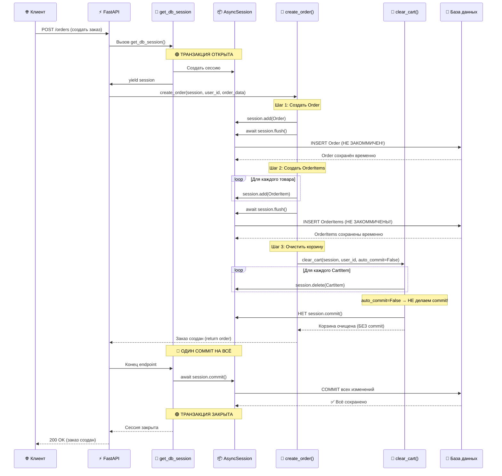
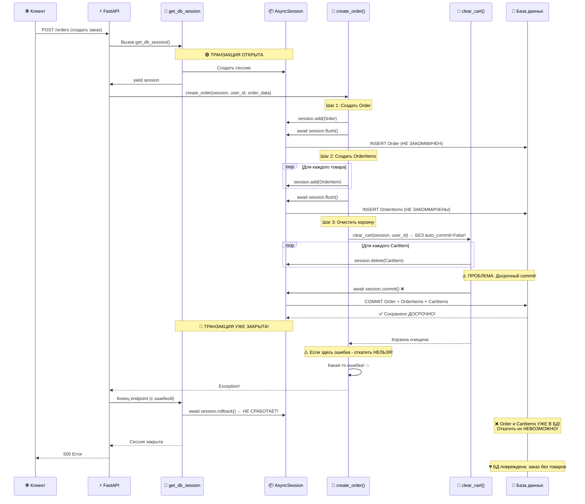
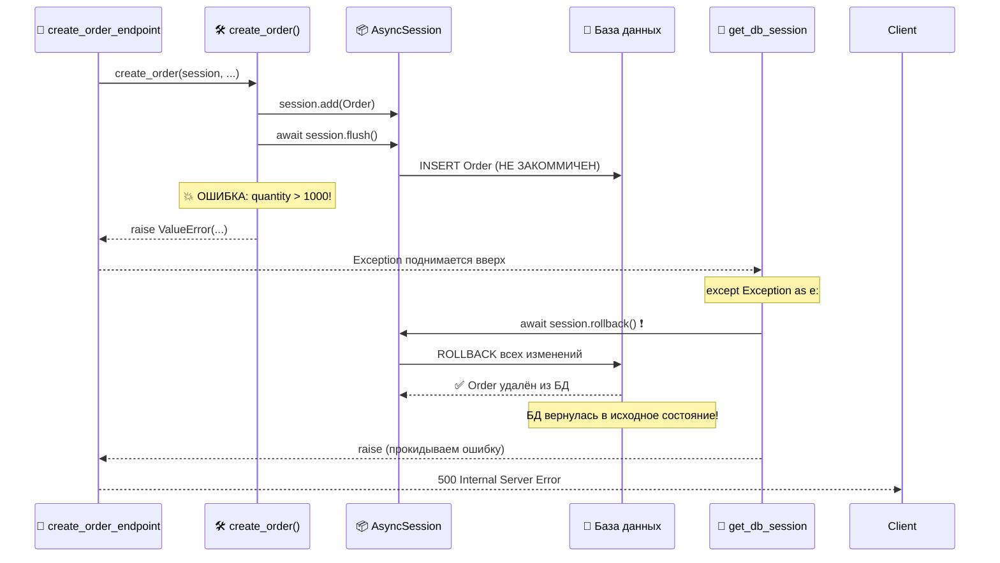

# 🔄 Решение конфликта транзакций в FastAPI

## 🎯 Проблема (для новичков)

### Что такое транзакция?

Представь, что ты переводишь деньги:

1. Снять 100₽ со счёта А
2. Положить 100₽ на счёт Б

**Транзакция** = "пакет" действий, которые должны выполниться **ВСЕ ВМЕСТЕ или НИКАК**.

Если шаг 2 провалился → шаг 1 тоже откатывается (rollback).

---

## 🐛 Ошибка которую мы получали

```
sqlalchemy.exc.InvalidRequestError: A transaction is already begun on this Session
```

### Что это значит простым языком?

Ты открыл коробку (начал транзакцию), начал складывать вещи, и **внутри** пытаешься закрыть и запечатать её — но она уже открыта!

---

## 🔍 Как это происходило в коде?

### Файл `core/database.py` (автоматическая транзакция)

```python
async def get_db_session() -> AsyncGenerator[AsyncSession, None]:
    async with AsyncSessionLocal() as session:  # ← Транзакция ОТКРЫТА
        try:
            yield session
            await session.commit()  # ← Транзакция ЗАКРЫТА (успех)
        except Exception as e:
            await session.rollback()  # ← Транзакция ОТКАЧЕНА (ошибка)
            raise
```

**FastAPI автоматически:**

- Открывает транзакцию при входе в endpoint
- Закрывает её после выполнения
- Откатывает при ошибке

---

### Файл `core/order_crud.py` (вложенная транзакция - ПРОБЛЕМА!)

```python
async def create_order(...):
    # ...
    
    # ❌ ПРОБЛЕМА: Пытаемся открыть транзакцию ЕЩЁ РАЗ!
    async with session.begin():
        order = Order(...)
        session.add(order)
        
        # Вызываем функцию которая делает commit ВНУТРИ
        await clear_cart(session, user_id)
```

### Файл `core/cart_crud.py` (commit внутри транзакции)

```python
async def clear_cart(session, user_id):
    # ...удаляем товары...
    
    await session.commit()  # ❌ Пытаемся закрыть уже открытую коробку!
```

---

## 🎨 Визуализация проблемы

```
FastAPI (get_db_session)
│
├─ [ТРАНЗАКЦИЯ ОТКРЫТА] ← Коробка открыта
│   │
│   ├─ create_order()
│   │   │
│   │   ├─ async with session.begin(): ← ❌ Пытаемся открыть ещё одну коробку!
│   │   │   │
│   │   │   ├─ Создать Order
│   │   │   ├─ Создать OrderItems
│   │   │   └─ clear_cart()
│   │   │       └─ session.commit() ← ❌ Пытаемся закрыть внутреннюю коробку!
│   │   │
│   │
│   └─ session.commit() ← ✅ Здесь должен быть ОДИН commit
```

---

## ✅ Решение

### Вариант 1: Убрать вложенную транзакцию (ВЫБРАЛИ МЫ)

**Идея:** FastAPI уже управляет транзакцией, не нужен `session.begin()`

#### До (ПЛОХО)

```python
async def create_order(session, user_id, order_data):
    # ❌ Лишняя обёртка
    async with session.begin():
        order = Order(...)
        session.add(order)
        await clear_cart(session, user_id)
```

#### После (ХОРОШО)

```python
async def create_order(session, user_id, order_data):
    # ✅ Просто работаем с сессией
    order = Order(...)
    session.add(order)
    await clear_cart(session, user_id, auto_commit=False)
    
    # Commit сделает get_db_session() автоматически
```

---

### Вариант 2: Добавить параметр `auto_commit`

**Идея:** Функции корзины используются двумя способами:

1. **Самостоятельно** (из API `/cart/add`) — нужен `commit()`
2. **Внутри транзакции** (в `create_order`) — `commit()` создаёт конфликт

#### Решение: Условный коммит

```python
async def clear_cart(
    session: AsyncSession,
    user_id: int,
    auto_commit: bool = True  # ← По умолчанию True
):
    cart = await get_or_create_cart(session, user_id, auto_commit=False)
    
    # Удаляем позиции
    for item in items:
        await session.delete(item)
    
    # Условный коммит
    if auto_commit:
        await session.commit()  # ← Для самостоятельного вызова
    # else: commit сделает внешняя транзакция
```

---

## 🔑 Ключевые термины

### `session.commit()`

"Закрыть и сохранить коробку" — все изменения записываются в БД навсегда.

### `session.rollback()`

"Выбросить всё из коробки" — откатить все изменения, вернуться к началу.

### `session.flush()`

"Подготовить данные, но НЕ закрывать коробку" — отправить в БД, но можно откатить.

### `session.begin()`

"Открыть новую коробку" — начать новую транзакцию.

### `async with session.begin():`

"Автоматическая коробка" — откроется при входе, закроется при выходе.

---

## 📋 Применение в FastAPI

### ✅ Правильный паттерн

```python
# 1. Dependency создаёт транзакцию
async def get_db_session():
    async with AsyncSessionLocal() as session:
        try:
            yield session
            await session.commit()  # ← Один commit на весь запрос
        except:
            await session.rollback()
            raise

# 2. Endpoint получает сессию
@app.post("/orders")
async def create_order_endpoint(
    session: AsyncSession = Depends(get_db_session)
):
    order = await create_order(session, ...)
    return order

# 3. CRUD-функция работает БЕЗ commit (если используется внутри транзакции)
async def create_order(session, ...):
    order = Order(...)
    session.add(order)
    await session.flush()  # ← Только flush, не commit
    
    await clear_cart(session, user_id, auto_commit=False)
    
    # Commit будет в get_db_session()
    return order
```

---

## 🎯 Атомарность операции

**Атомарность** = "Всё или ничего"

### Наша операция создания заказа

```
[ОДНА ТРАНЗАКЦИЯ]
│
├─ 1. Создать Order
├─ 2. Создать OrderItem (товар 1)
├─ 3. Создать OrderItem (товар 2)
├─ 4. Удалить CartItem (товар 1)
├─ 5. Удалить CartItem (товар 2)
│
└─ COMMIT ← Всё сохраняется ОДНИМ ПАКЕТОМ
```

Если **любой** шаг упадёт с ошибкой → **ВСЁ** откатывается:

- Заказ не создастся
- Корзина не очистится
- БД останется в прежнем состоянии

---

## 🎬 Диаграмма последовательности: Создание заказа

### 📊 Схема работы с `auto_commit=False` (ПРАВИЛЬНО)



---

### ❌ Схема работы БЕЗ `auto_commit=False` (НЕПРАВИЛЬНО)



---

## 🎯 Пошаговое объяснение создания заказа

### Сценарий: Пользователь оформляет заказ на 3 товара

Давай разберём **пошагово**, что происходит при создании заказа.

---

### 📍 Шаг 0: Клиент отправляет запрос

```http
POST /orders
Authorization: Bearer <token>
Content-Type: application/json

{
  "delivery_address": "ул. Пушкина, д. 10",
  "phone": "+7-999-123-45-67"
}
```

**Что у нас в БД:**

- **Корзина:** 3 товара (Товар A, Товар B, Товар C)
- **Заказы:** пусто

---

### 📍 Шаг 1: FastAPI получает запрос

```python
@router.post("/")
async def create_order_endpoint(
    order_data: OrderCreate,
    session: AsyncSession = Depends(get_db_session),  # ← ЗДЕСЬ!
    current_user: User = Depends(get_current_user),
):
    order = await create_order(session, current_user.id, order_data)
    return order
```

**Что происходит:**

1. FastAPI видит `Depends(get_db_session)`
2. Вызывает функцию [`get_db_session()`](core/database.py )
3. Создаётся **одна сессия** для всего запроса

---

### 📍 Шаг 2: `get_db_session()` открывает транзакцию

```python
async def get_db_session() -> AsyncGenerator[AsyncSession, None]:
    async with AsyncSessionLocal() as session:  # ← Сессия создана
        try:
            logger.debug("🔌 Открыта новая сессия БД")
            yield session  # ← Передаём в endpoint
            # ↓ Код ниже выполнится ПОСЛЕ завершения endpoint
            await session.commit()  # ← Commit в КОНЦЕ
            logger.debug("✅ Сессия БД закоммичена")
        except Exception as e:
            await session.rollback()  # ← Rollback при ошибке
            raise
```

**Состояние:**

- ✅ Транзакция **открыта**
- ✅ Сессия передана в `create_order_endpoint()`

---

### 📍 Шаг 3: Вызов `create_order()`

```python
async def create_order(
    session: AsyncSession,
    user_id: int,
    order_data: OrderCreate
) -> Order:
    # Получаем корзину с товарами
    cart = await get_cart_with_items(session, user_id)
    
    # Считаем сумму
    total_amount = sum(
        item.product.price_shmeckles * item.quantity 
        for item in cart.items
    )
    # total_amount = 1500 (например)
```

**Состояние:**

- ✅ Транзакция **открыта**
- 📊 Получили данные корзины (3 товара)
- 📊 Посчитали сумму (1500 рублей)

---

### 📍 Шаг 4: Создаём Order

```python
    # Создаём заказ
    order = Order(
        user_id=user_id,
        created_at=datetime.utcnow(),
        status="pending",
        total_amount=total_amount,  # 1500
        delivery_address=order_data.delivery_address,
        phone=order_data.phone,
    )
    session.add(order)
    await session.flush()  # ← Отправляем в БД, но НЕ коммитим!
```

**Что делает `flush()`:**

- ✅ Отправляет `INSERT` в базу данных
- ✅ Order получает `id` (например, `id=42`)
- ❌ **НЕ делает commit** — транзакция ещё открыта!

**Состояние БД:**

```sql
-- Временная таблица (можно откатить!)
Orders:
  id=42, user_id=1, total_amount=1500, status='pending' [НЕ ЗАКОММИЧЕН]
```

---

### 📍 Шаг 5: Создаём OrderItems

```python
    # Создаём позиции заказа
    for cart_item in cart.items:
        order_item = OrderItem(
            order_id=order.id,  # 42
            product_id=cart_item.product_id,
            quantity=cart_item.quantity,
            frozen_name=cart_item.product.name,
            frozen_price=cart_item.product.price_shmeckles,
        )
        session.add(order_item)
```

**Состояние БД:**

```sql
-- Временная таблица (можно откатить!)
OrderItems:
  id=101, order_id=42, product_id=1, quantity=2, frozen_price=500 [НЕ ЗАКОММИЧЕН]
  id=102, order_id=42, product_id=5, quantity=1, frozen_price=300 [НЕ ЗАКОММИЧЕН]
  id=103, order_id=42, product_id=8, quantity=3, frozen_price=200 [НЕ ЗАКОММИЧЕН]
```

---

### 📍 Шаг 6: Очищаем корзину

```python
    # Очищаем корзину БЕЗ commit
    await clear_cart(session, user_id, auto_commit=False)  # ← ВАЖНО!
```

**Что происходит внутри `clear_cart()`:**

```python
async def clear_cart(
    session: AsyncSession,
    user_id: int,
    auto_commit: bool = True  # ← Но мы передали False!
):
    cart = await get_or_create_cart(session, user_id, auto_commit=False)
    
    # Удаляем все позиции
    for item in items:
        await session.delete(item)
    
    # Проверка флага
    if auto_commit:  # False → пропускаем!
        await session.commit()  # ← НЕ ВЫПОЛНЯЕТСЯ!
    
    # Возвращаемся без commit
```

**Состояние БД:**

```sql
-- Временная таблица (можно откатить!)
CartItems:
  id=1, cart_id=1, product_id=1, quantity=2 [УДАЛЁН, НЕ ЗАКОММИЧЕН]
  id=2, cart_id=1, product_id=5, quantity=1 [УДАЛЁН, НЕ ЗАКОММИЧЕН]
  id=3, cart_id=1, product_id=8, quantity=3 [УДАЛЁН, НЕ ЗАКОММИЧЕН]
```

---

### 📍 Шаг 7: Функция `create_order()` завершается

```python
    # Перезагружаем заказ с позициями
    stmt = select(Order).where(Order.id == order.id).options(...)
    result = await session.execute(stmt)
    order = result.scalar_one()
    
    return order  # ← Возвращаемся в endpoint
```

**Состояние:**

- ✅ Транзакция **ВСЁ ЕЩЁ открыта**
- 📊 В БД **временно** (можно откатить):
  - Order (id=42)
  - 3 OrderItems
  - Корзина очищена (3 CartItems удалены)

---

### 📍 Шаг 8: Endpoint завершается

```python
@router.post("/")
async def create_order_endpoint(...):
    order = await create_order(session, current_user.id, order_data)
    return order  # ← Выходим из endpoint
```

**FastAPI видит:**

- ✅ Endpoint завершился без ошибок
- ✅ Возвращаемся к `get_db_session()`

---

### 📍 Шаг 9: `get_db_session()` делает commit

```python
async def get_db_session():
    async with AsyncSessionLocal() as session:
        try:
            yield session  # ← Сюда мы вернулись
            
            # ↓ ОДИН COMMIT НА ВСЁ!
            await session.commit()  # ← ЗДЕСЬ!
            logger.debug("✅ Сессия БД закоммичена")
        except Exception as e:
            await session.rollback()
            raise
```

**Что происходит:**

```sql
-- COMMIT всех изменений ОДНОВРЕМЕННО
COMMIT;

-- Теперь ВСЁ сохранено навсегда:
Orders:
  id=42, user_id=1, total_amount=1500 [✅ ЗАКОММИЧЕН]

OrderItems:
  id=101, order_id=42, product_id=1 [✅ ЗАКОММИЧЕН]
  id=102, order_id=42, product_id=5 [✅ ЗАКОММИЧЕН]
  id=103, order_id=42, product_id=8 [✅ ЗАКОММИЧЕН]

CartItems:
  (пусто - всё удалено) [✅ ЗАКОММИЧЕНО]
```

---

### 📍 Шаг 10: Ответ клиенту

```python
FastAPI-->>Client: 200 OK
{
  "id": 42,
  "user_id": 1,
  "total_amount": 1500,
  "status": "pending",
  "items": [...]
}
```

---

## 🎭 Сценарий с ошибкой (автоматический rollback)

### Что если на шаге 5 произошла ошибка?

```python
async def create_order(...):
    # Шаги 1-4: Order создан, flush сделан
    
    # Шаг 5: Создаём OrderItems
    for cart_item in cart.items:
        if cart_item.quantity > 1000:
            raise ValueError("Слишком большое количество!")  # 💥 ОШИБКА!
        
        order_item = OrderItem(...)
        session.add(order_item)
```

**Что происходит:**



**Результат:**

- ❌ Order **НЕ создан** (откатился)
- ❌ OrderItems **НЕ созданы** (не успели)
- ❌ Корзина **НЕ очищена** (не успели)
- ✅ БД осталась в **исходном состоянии** — атомарность сохранена!

---

## 🚀 Итого

### ❌ Что было плохо

- `session.begin()` внутри уже открытой транзакции
- `session.commit()` в функциях, вызываемых внутри транзакции
- Конфликт вложенных транзакций

### ✅ Что стало хорошо

- Одна транзакция на весь HTTP-запрос (управляется FastAPI)
- `auto_commit` параметр для универсальности функций
- Атомарность сохранена: вся операция выполняется целиком или откатывается

### 🎓 Главный урок

**FastAPI уже управляет транзакциями через Dependency Injection.**
Не нужно открывать новые транзакции внутри CRUD-функций, если они вызываются из endpoints!

### 🔑 Ключевая идея `auto_commit`

**Флаг `auto_commit` позволяет:**

- ✅ Использовать одну функцию **самостоятельно** (с commit) и **внутри транзакции** (без commit)
- ✅ Сохранять **атомарность** сложных операций (создание заказа = несколько функций, один commit)
- ✅ Избегать **дублирования кода** (не нужны две версии каждой функции)

---

## 📚 Дополнительные материалы

- [SQLAlchemy Async Transactions](https://docs.sqlalchemy.org/en/20/orm/extensions/asyncio.html)
- [FastAPI Dependencies](https://fastapi.tiangolo.com/tutorial/dependencies/)
- [Database Transactions Explained](https://www.postgresql.org/docs/current/tutorial-transactions.html)
- [ACID Properties](https://en.wikipedia.org/wiki/ACID)
