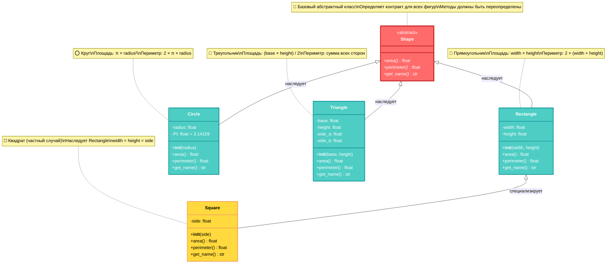

# ЭТАЛОННЫЙ ПРИМЕР ИДЕАЛЬНОГО РЕЗУЛЬТАТА

## Полиморфизм в Python

Полиморфизм — это возможность объектов разных классов отвечать на одни и те же сообщения (вызовы методов), при этом каждый класс реализует эти методы по-своему. В Python полиморфизм реализуется естественно благодаря динамической типизации и концепции duck typing.

Зачем нужен полиморфизм? Он позволяет писать код, который работает с объектами разных типов единообразно, не зная их конкретного класса. Это критически важно для создания расширяемых приложений — вы можете добавлять новые типы объектов, не изменяя существующий код.

### Duck Typing — философия Python

**Duck typing** — это основополагающий принцип полиморфизма в Python.

> Название происходит от фразы: "Если это ходит как утка и крякает как утка, то это, вероятно, утка". В контексте программирования это означает: если объект предоставляет нужные методы, то его конкретный тип не важен.

Вот пример, иллюстрирующий duck typing:

```python
# Базовый класс
class Shape:
    def area(self):
        raise NotImplementedError("Метод должен быть переопределен")

# Дочерние классы
class Rectangle(Shape):
    def __init__(self, width, height):
        self.width = width
        self.height = height
    
    def area(self):
        return self.width * self.height

class Circle(Shape):
    def __init__(self, radius):
        self.radius = radius
    
    def area(self):
        return 3.14159 * self.radius ** 2

# Использование
shapes = [Rectangle(5, 3), Circle(4)]
for shape in shapes:
    print(f"Площадь: {shape.area()}")
```

Обратите внимание: в цикле мы вызываем `shape.area()`, не проверяя, какой именно это класс. Python сам находит правильную реализацию метода во время выполнения.

### Переопределение методов

Переопределение методов (method overriding) — это механизм, при котором дочерний класс предоставляет специфическую реализацию метода, уже определенного в родительском классе. В примере выше классы `Rectangle` и `Circle` переопределяют метод `area()`, предоставляя собственные алгоритмы вычисления площади.

Важно понимать различие между этим подходом и альтернативой с проверкой типов:

```python
# ❌ Плохо: проверка типов вместо полиморфизма
def calculate_area(shape):
    if isinstance(shape, Rectangle):
        return shape.width * shape.height
    elif isinstance(shape, Circle):
        return 3.14159 * shape.radius ** 2
    else:
        raise ValueError("Неизвестный тип фигуры")

# ✅ Хорошо: полиморфизм
def calculate_area(shape):
    return shape.area()  # Каждый объект знает, как вычислить свою площадь
```

Полиморфный подход лучше, поскольку при добавлении новой фигуры вам не нужно изменять функцию `calculate_area()` — достаточно создать новый класс с методом `area()`.

### Протоколы typing для явного описания интерфейсов

Начиная с Python 3.8, вы можете использовать `typing.Protocol` для явного описания того, какие методы должен предоставлять объект:

```python
from typing import Protocol

class Drawable(Protocol):
    def area(self) -> float:
        ...
    
    def perimeter(self) -> float:
        ...

def print_shape_info(shape: Drawable) -> None:
    print(f"Площадь: {shape.area():.2f}")
    print(f"Периметр: {shape.perimeter():.2f}")
```

Протоколы не требуют наследования — любой класс, который предоставляет нужные методы, автоматически считается соответствующим протоколу.

### Практическое применение

В реальных проектах полиморфизм часто используется для создания плагинных архитектур. Представьте систему обработки платежей:

```python
from abc import ABC, abstractmethod

class PaymentProcessor(ABC):
    """
    Базовый интерфейс для всех процессоров платежей.
    """
    @abstractmethod
    def process_payment(self, amount: float) -> bool:
        pass

class CreditCardProcessor(PaymentProcessor):
    """
    Процессор платежей по кредитной карте.
    """
    def process_payment(self, amount: float) -> bool:
        # Логика обработки платежей по кредитной карте
        print(f"Обработка {amount} руб. через кредитную карту")
        return True

class PayPalProcessor(PaymentProcessor):
    def process_payment(self, amount: float) -> bool:
        # Логика обработки платежей через PayPal
        print(f"Обработка {amount} руб. через PayPal")
        return True

# Единообразное использование
def handle_purchase(processor: PaymentProcessor, amount: float):
    if processor.process_payment(amount):
        print("Платеж успешно обработан")
    else:
        print("Ошибка при обработке платежа")
```

Такой подход позволяет легко добавлять новые способы оплаты, не изменяя логику обработки покупок.

### Архитектурная диаграмма полиморфизма



*Иерархия классов демонстрирует единый интерфейс для разных реализаций*

### Преимущества полиморфного подхода

Полиморфизм решает фундаментальную проблему расширяемости кода. Вместо жестко закодированных проверок типов вы получаете гибкую архитектуру, которая легко адаптируется к изменениям требований.

Представьте, что через год вам понадобится добавить поддержку еще десяти типов фигур. С полиморфным подходом это займет минуты — просто создайте новые классы с методом `area()`. Без полиморфизма вам придется переписывать всю логику обработки, добавляя новые `elif` блоки в каждую функцию.

Это и есть сила полиморфизма — возможность писать код один раз и использовать его для неограниченного количества типов объектов, которые еще даже не существуют на момент написания кода.
